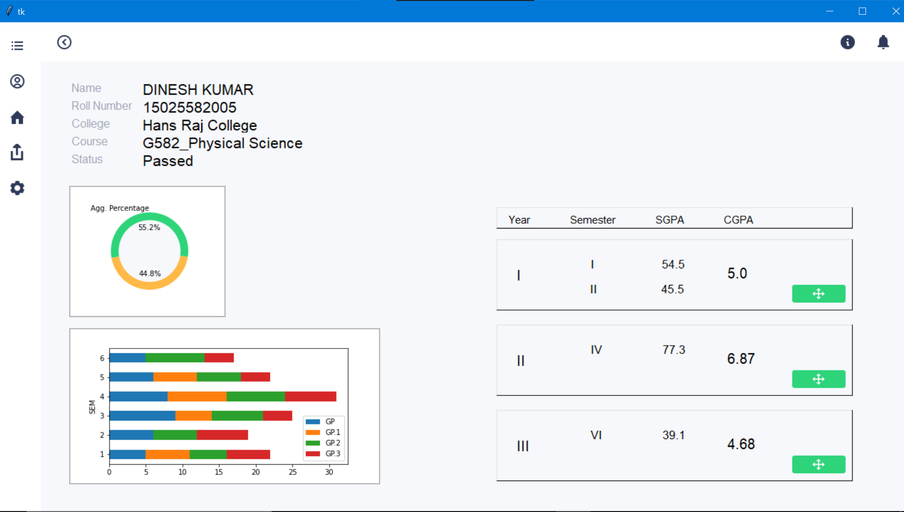
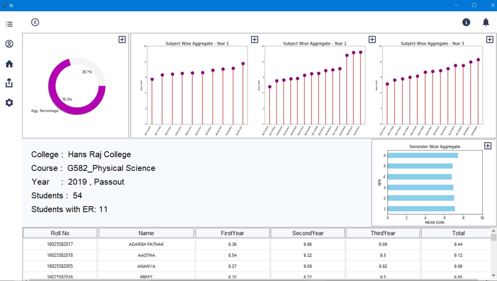
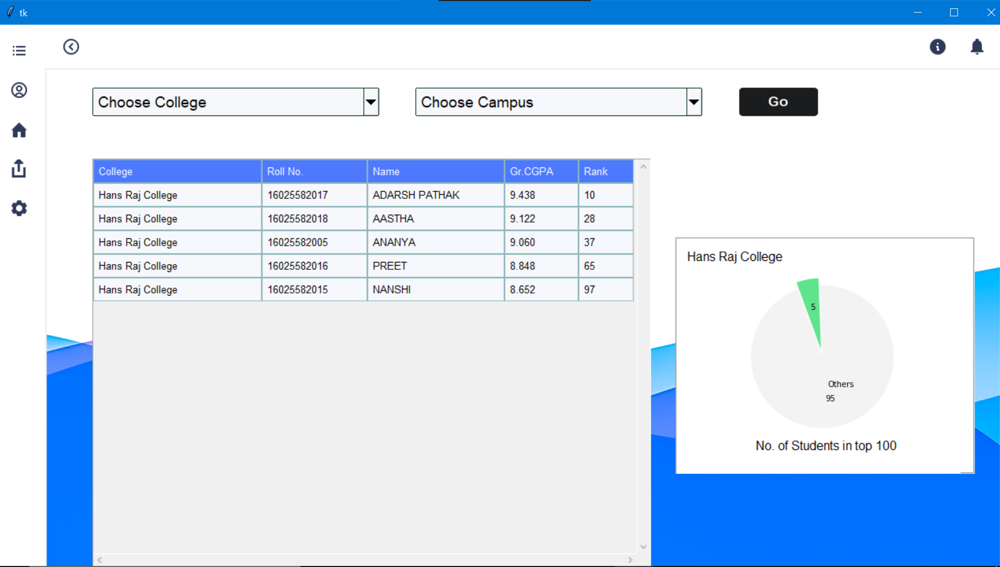
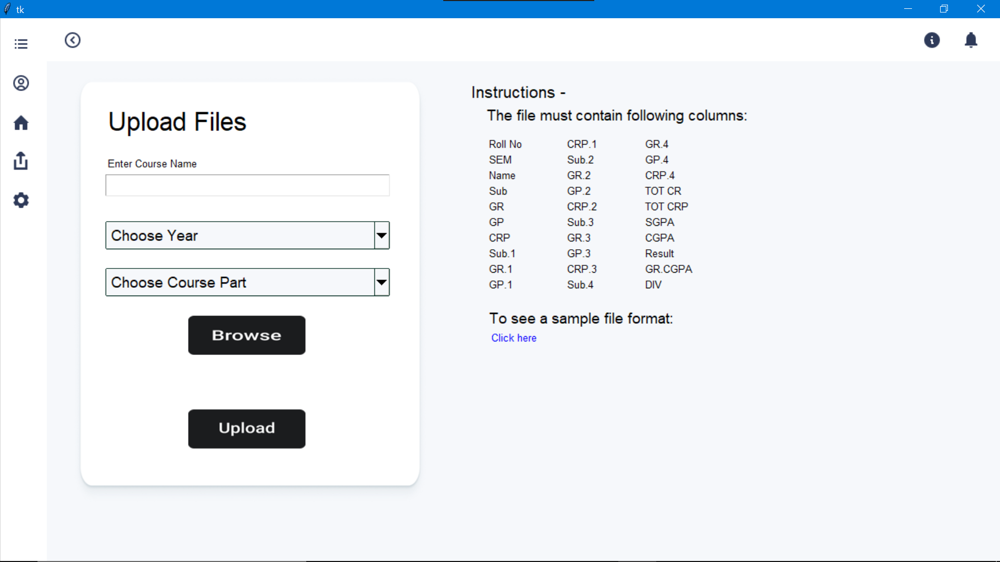

# Result Analysis Tool

**Undergraduate Project**

## Introduction:
Delhi University has over 90+ colleges offering various courses. Thus there is a huge compilation of data that needs to be analyzed to determine various performance quotients of students. It becomes an exhaustive task to manually
process it. Thus we have tried to design a desktop application to ease the process of result analysis for implementation in our college.

This is a simple GUI based desktop app to work with the result data and process it using different parameters set according to the information required.

## Main Tools Used

We have used Python language for the entire application. Some of the main libraries used are:

1. [Tkinter](https://docs.python.org/3/library/tk.html) -  for GUI
2. [Numpy](https://numpy.org/doc/) and [Pandas](https://pandas.pydata.org/docs/) for Analysis
3. [Matplotlib](https://matplotlib.org/stable/contents.html) and [Seaborn](https://seaborn.pydata.org/) for Visualisation
4. [pdfplumber](https://github.com/jsvine/pdfplumber/blob/stable/README.md) for data extraction from PDF files
5. [Pillow](https://pillow.readthedocs.io/en/stable/) for working with images

## Approach towards App Development

The app first takes us to the home page, where the user has to select the desired options for navigating to the student details, course details or ranking page. We have also provided info buttons on the top to give details of each page and its functioning. The side toolbar provides various other options.

>**The work on the application is still under progress, so only some buttons may respond.** 

## Design of GUI

The interface is designed using tkinter where we have used different classes for individual pages and controlling the navigation through the parent class. We have used frames and
methods to make an easy to use, hassle free environment which not only helps the user to get work done but is also
designed to improve efficiency by simplifying the workflow.

___
 

# Description of Pages

## 1. Home Page

 

>

* This is the landing page of the application.
* Here, a user can choose different values for the provided options and go for the required data i.e. of particular student, of the entire course and/or to get the ranking of the students of the selected course of the selected college among the students of the university by clicking on the buttons provided.
* The info button on the top provides the page information.
* The upload button on the left toolbar takes us to the upload page, where the user can upload the result data of a course for analysis.
* The Home Button take us to home page i.e. this very page.
* Rest all the buttons do not have any command specified, as the work on application is currently under development.

 

## 2. Student Selection Page

 

>

* This is the page where names of students can be selected for individual result analysis.
* Rest all the functionalities remain same.

 

## 3. Student Page

 

>

* The page shows result of individual students and its analysis.
* The expand buttons on the bottom right corners of the CGPA frames displays a toplevel window with charts for subject-wise distribution of credits in each semester.

 

## 4. Course Page

 

>

* This page displays the result data of the entire course along with a list of all the students of that course.

 

## 5. Ranking Page

 

>

* The page by default shows the ranking of the students of the selected course of the selected college (from the home page) among other university students.
* The user can view ranking of other college students of the same course by selecting the college name from the combobox.
* The campus in for which the ranking is to be displayed can also be selected.
* Choose 'None' in the college combobox to view top 100 students of the selected course.

 

## 6. Upload Page

 

>

  * This page enables the user to explicitly select the result data file from the local computer for which the analysis is to be done.

___
 

# Conclusion
This application is intended to be University specific and is currently under development. It is advised to only upload csv files of result as converting pdf files to csv brings many inconsistensies which cannot be handled in the runtime.
This entire application is based on the fact that a csv file must be uploaded, the details of which are given on the upload page.

 

# Contributors

1. Aditya Goyal
2. Devesh Yadav
3. Jasveer  Singh Yadav
4. Sushant Sharma

**Acharya Narendra Dev College, University of Delhi**
